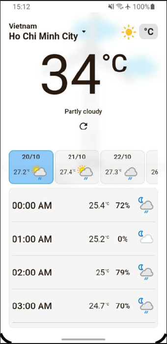
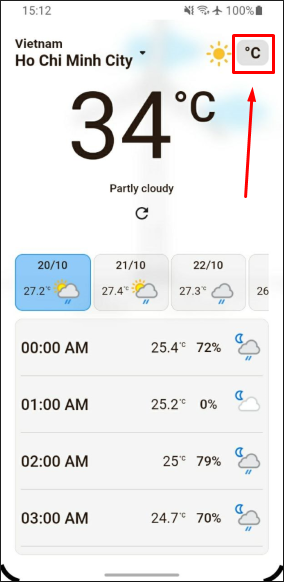
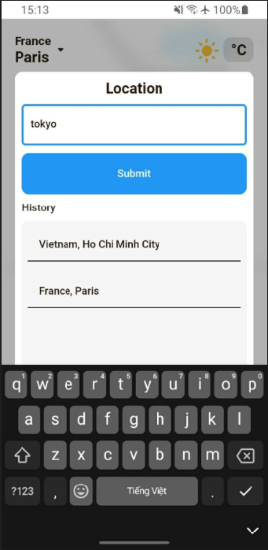
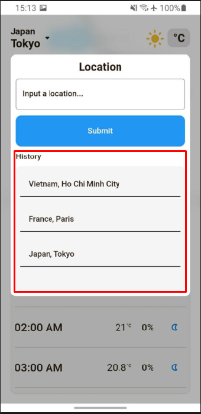
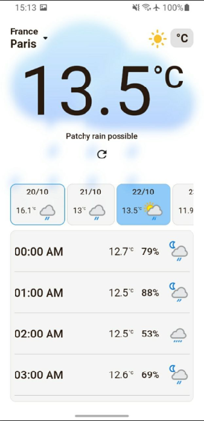
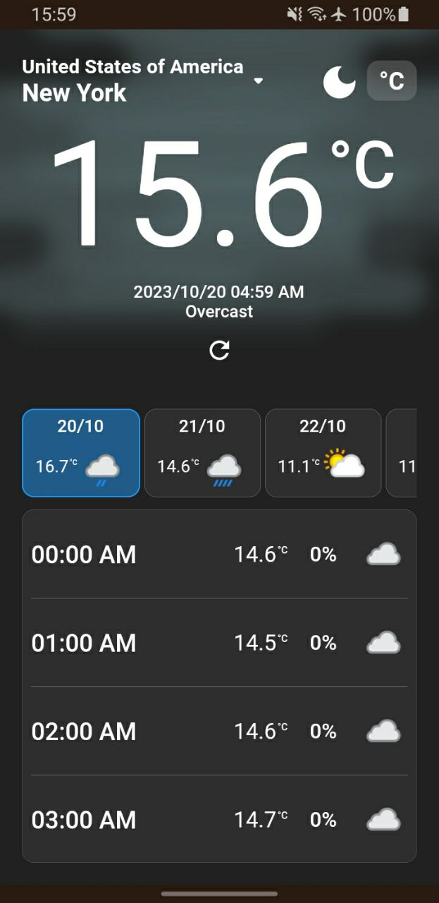

# weather_app
This application can help people view weather all around the world.

# Install on real device
[release.apk](release_build/weather_app_release.apk)

# For debug run
- This project run on flutter v3.13.8
- Run these command before run:
    + flutter pub get
    + flutter packages pub run build_runner build --delete-conflicting-outputs
# Features
- Shows the weather of the current location when opening the app for the first time.
- View temperature in Celsius (°C) or Fahrenheit (°F).
- Input a location and view weather there.
- Save viewed location history.
- Weather forecast for the next 10 days.
- View weather by time of day.
- Auto turn on dark theme when the sun has gone down at the location.

# Getting Started
- Shows the weather of the current location when opening the app for the first time.
When open the app for the first time, it will know the user current location
(This function just run on Android because limited of dev devices).

- View temperature in Celsius (°C) or Fahrenheit (°F).
On home screen, tap the unit button to change between C and F.

- Input a location and view weather there.
Select to city name to open the dialog > input a city name, country name > press 'Submit' button.

- Save viewed location history.
In the select location dialog, the app save view history, select an item to view it again.

- Weather forecast for the next 10 days, view weather by time of day.

- Auto turn on dark theme when the sun has gone down at the location.

